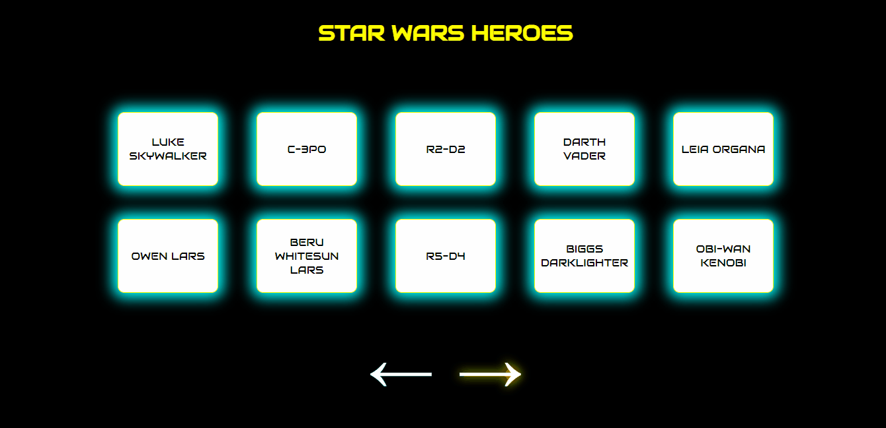

# STARWARS

This web app is created as a final project of Advanced JavaScript Course at ITEA.UA
It displays the heroes list of Star Wars and their description making HTTP requests to https://swapi.dev/.

## Description

Each page shows 10 heroes and clicking on each one appears a modal with deatails.
Pagination buttons get disabled when there are no more pages available.

## Technologies

- HTML
- CSS
- JS
- AXIOS

## Problems that I faced during the development

- When clicking on each hero several times, the table with description was accumulating the data, so that each cell had a repeated information. In order to solve this bug, I added some code to clear up the innerHTML of each cell when the close button is clicked.

- Storing the page number in localStorage. There was a bug where by clicking on pagination buttons, the page number was incrementing/decrementing incorrecty. The solution was to change the logical operator in the function where the pages are incrementing and decrementing from **x += 1** to **++x**
